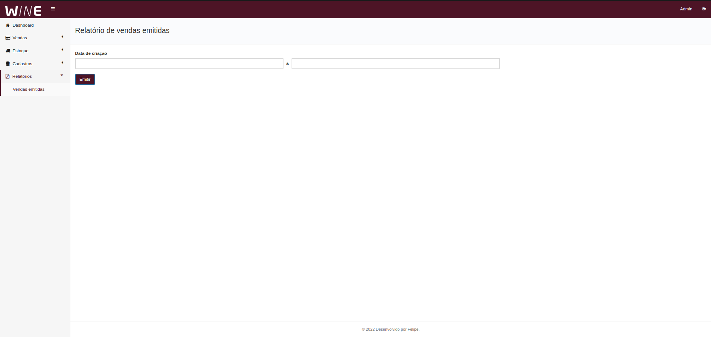

「Wine Guys 」
=======

Sistema de gestão e venda de vinhos

### Recursos

- Persistência com Spring JPA
- Autenticação e Autorização com Spring Security
- Dashboard com Gráficos
- Interface com Thymeleaf
- Geração de Relatório com JaperReports
- Upload de arquivos Local
- Suporte da AWS S3
- Filtro de Busca com Criteria
- Paginação

entre outros recursos ...

#### Screenshots

